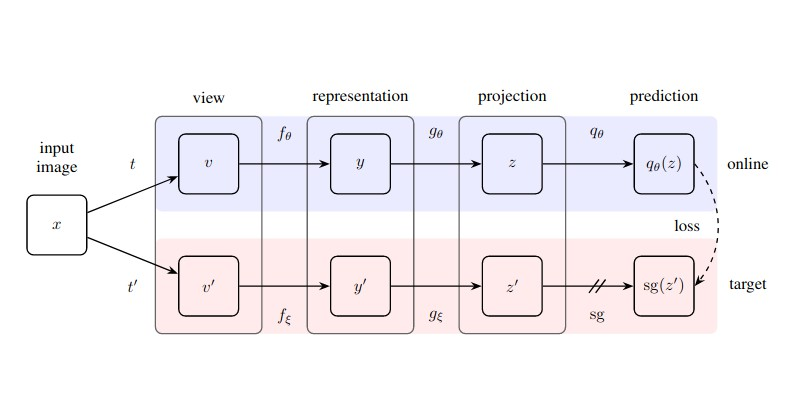

# Bootstrap Your Own Latent (BYOL) implementation in PyTorch

This is an implementation of the new DeepMind paper [*Bootstrap Your Own Latent: A New Approach to Self-Supervised Learning*](https://arxiv.org/pdf/2006.07733.pdf). 

If you'd like to use this model it's available in the [PyTorch Lightning Bolts](https://github.com/PyTorchLightning/pytorch-lightning-bolts) library where it has been tested, benchmarked against dataset and documented.

Read the BYOL docs [here](https://pytorch-lightning-bolts.readthedocs.io/en/latest/self_supervised_models.html#byol).

Note: this is still a work in progress. The model currently achieves ~60% test accuracy on CIFAR-10. 

